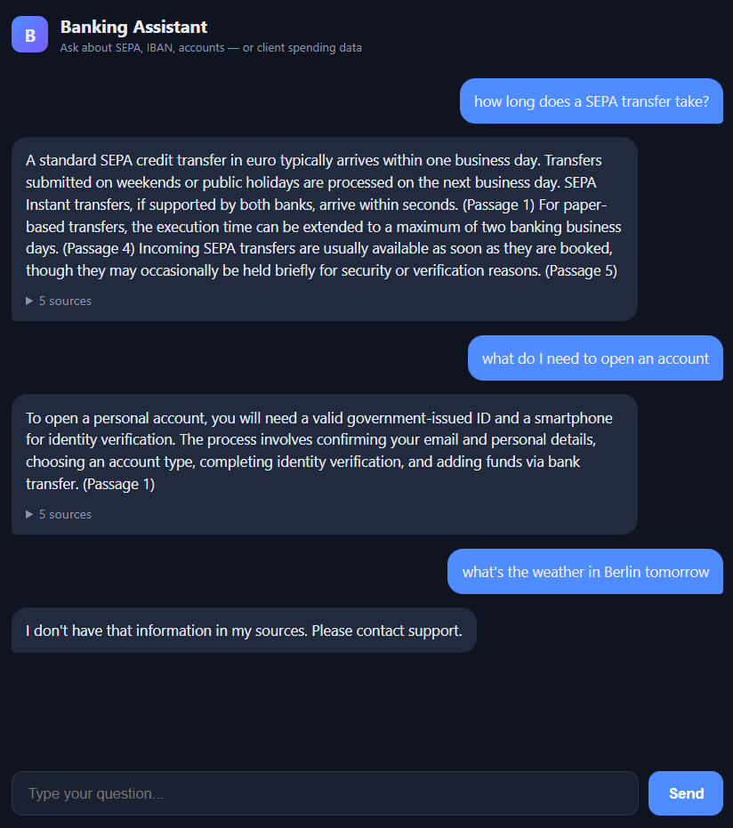
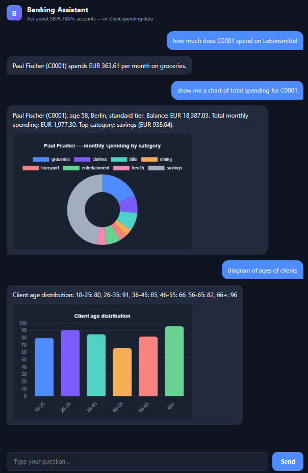
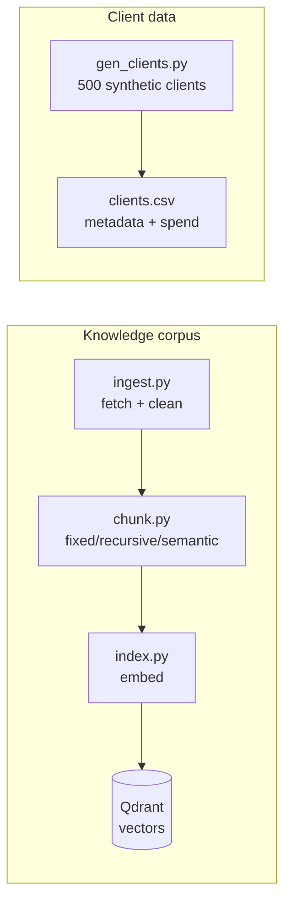
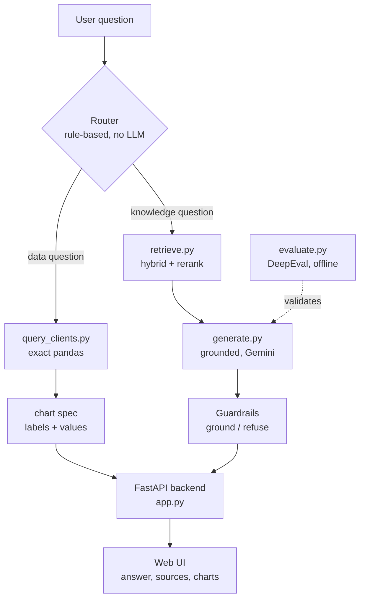

# Banking Assistant

A European retail-banking assistant that handles two different kinds of question in one chat interface. Ask it how a SEPA transfer works and it retrieves the answer from a banking corpus and cites its sources. Ask it how much a client spends on groceries, or for the age distribution of all clients, and it queries a client table directly and can draw you a chart.

The two question types are handled by two different backends, and a small router decides which one each question goes to. The retrieval side is also set up as a benchmark of RAG methods rather than a single fixed pipeline, so the choice of chunking and retrieval strategy is measured rather than assumed.

Everything runs on openly-licensed or self-generated data, so the whole repo is safe to publish.

## Demo

Knowledge questions get grounded answers with sources, and out-of-scope questions are refused rather than answered from guesswork:



Data questions are answered with exact figures from the client table, and charts appear on request or from a button under any data answer:



## How it works

The system has an offline build step and a runtime query flow.

### Build pipeline

Before any question is asked, two things are prepared: the knowledge corpus (fetched, chunked, embedded, stored in Qdrant) and the synthetic client table.



### Runtime flow

A question hits the router, which sends it down the data path or the RAG path. The RAG path ends in a guardrail stage that grounds the answer or refuses. DeepEval validates the RAG path offline.



The router is deliberately rule-based rather than an LLM call. It looks for client IDs, spending categories, aggregate words, counts, and distribution fields; anything it doesn't recognise as a data question falls through to the RAG path. Keeping it rule-based makes routing deterministic, free, and easy to debug — and it means data questions never wait on an API.

The reason for splitting the two paths at all is that retrieval is the wrong tool for numbers. Embeddings are good at meaning but bad at arithmetic — they can't reliably sum, filter, or rank. So "how much does C0001 spend on groceries" goes to pandas, which computes an exact answer, while "how do SEPA transfers work" goes to retrieval, which is what it's actually good at.

## The two paths

### Knowledge questions (RAG)

Retrieval uses a hybrid of BM25 (exact-term matching) and dense embeddings, with an optional cross-encoder reranker on top. Hybrid matters here because banking questions are full of exact terms — IBAN, BIC, SEPA Core — that pure semantic search tends to blur. Generation answers only from the retrieved passages and refuses when the answer isn't there, which is the behaviour you want in a banking context. The refusal is a real feature, not a limitation: it's what stops the assistant inventing account rules.

### Data questions (structured data)

A set of pandas query functions in `query_clients.py` answer questions about a table of synthetic clients — 500 fake customers with metadata (age, city, tier, job, balance) and monthly spending across eight categories. Supported questions include:

- Per-client lookup — "tell me about client C0001", "how much does C0001 spend on Lebensmittel" (German category names work too)
- Aggregates — "total spending by category", "top 5 grocery spenders in Leipzig", "average groceries by tier"
- Counts — "how many clients do we have", "how many premium clients"
- Distributions — "age distribution of clients", "clients by city", "gender breakdown"

How a client question resolves is a fixed rule, so the behaviour is predictable: a client ID on its own ("C0001", "spending of client C0001") returns that client's summary — balance, total spend, and top category. Add a category ("C0001 groceries") and you get just that figure. Ask for a chart ("diagram of C0001 spending") and you get the full category breakdown as a doughnut. Same client, three levels of detail, chosen by what you include in the question.

Each answer also carries a chart spec, so any data question can be visualised. Charts show automatically when the question asks for one ("show me a chart of…", "diagram of…"), and otherwise appear from a button under the answer. Rule-based routing has honest limits — an unusual phrasing may not match — so the supported question types above are the documented boundary rather than a promise to understand everything.

## The RAG benchmark

The retrieval side is built to compare methods, not to ship one. Two axes are varied while the embedding model and vector store are held fixed:

| Axis | Variants |
|------|----------|
| Chunking | fixed-size, recursive, semantic |
| Retrieval | dense-only, hybrid (BM25 + dense), hybrid + reranker |

Evaluation uses [DeepEval](https://github.com/confident-ai/deepeval) with a golden Q&A set, scoring faithfulness, answer relevancy, and contextual precision/recall. `src/evaluate.py` runs a method and writes its scores to `results/`.

One finding is worth stating plainly: on the small, clean FAQ corpus all three retrieval methods score about the same. Hybrid's advantage only shows up once the term-dense Bundesbank SEPA pages are added, where BM25's exact-term matching starts to matter. Hybrid isn't universally better — it depends on the corpus and the query — and measuring that trade-off is the point of the benchmark.

## Data sources

| Layer | Source | Licence | Role |
|-------|--------|---------|------|
| Payments / regulatory | Deutsche Bundesbank SEPA pages | Public-sector info | Term-dense corpus (IBAN, BIC, SEPA) |
| Government FAQ (PDF) | DPMA SEPA leaflet | Government document | Exercises the PDF ingestion path |
| Neobank FAQ | Self-authored (`data/raw/neobank_faq.jsonl`) | This repo (MIT) | Conversational support layer |
| Client table | Synthetic (`src/gen_clients.py`) | This repo (MIT) | 500 fake clients for the data assistant |

Fetched public content is not committed — only the fetch script (`src/ingest.py`) is. The self-authored FAQ and the synthetic client data are safe to publish.

## Running it

```bash
pip install -r requirements.txt

# build the banking corpus
python src/ingest.py
python src/chunk.py --strategy recursive --in data/processed/corpus.jsonl --out data/processed/chunks_recursive.jsonl
python src/index.py --chunks data/processed/chunks_recursive.jsonl --collection banking_recursive

# generate the synthetic client data
python src/gen_clients.py --n 500

# set your Gemini key (used only for the knowledge path)
# PowerShell:  $env:GEMINI_API_KEY = "your-key"
export GEMINI_API_KEY="your-key"

# run the app
uvicorn src.app:app --reload --port 8000
# open http://localhost:8000
```

Data questions run entirely on pandas and need no API key. Only knowledge questions call Gemini.

Chart.js is served locally from `frontend/` rather than a CDN, so the UI works on networks that block external scripts.

### Running the benchmark

```bash
python src/evaluate.py --chunks data/processed/chunks_recursive.jsonl --collection banking_recursive --method dense --limit 10
python src/evaluate.py ... --method hybrid --limit 10
python src/evaluate.py ... --method hybrid_rerank --limit 10
```

## Stack

Python, FastAPI, Qdrant, sentence-transformers (embeddings and cross-encoder rerank), rank-bm25, pandas, Chart.js, Google Gemini, DeepEval.

## Layout

```
src/
  ingest.py         fetch and clean public sources into corpus.jsonl
  chunk.py          fixed / recursive / semantic chunkers
  index.py          embed and build the Qdrant index
  retrieve.py       dense / hybrid / hybrid+rerank retrieval
  generate.py       grounded generation with guardrails
  gen_clients.py    synthetic client data generator
  query_clients.py  pandas queries and chart specs
  router.py         data-vs-knowledge routing
  app.py            FastAPI backend
  evaluate.py       DeepEval benchmark harness
frontend/
  index.html        chat UI with Chart.js
data/eval/          golden Q&A set
```

## Notes

This is a demonstration built on synthetic and public data. It isn't a production banking system and gives no financial advice. Gemini's free tier is tight on rate limits — the app runs fine on it for interactive use, but the RAG evaluation is easier to run with billing enabled.
