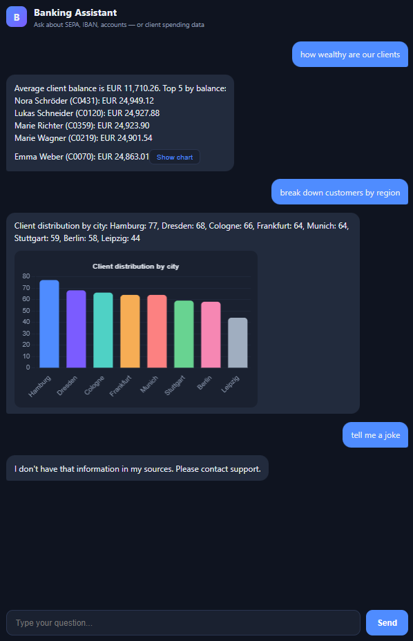
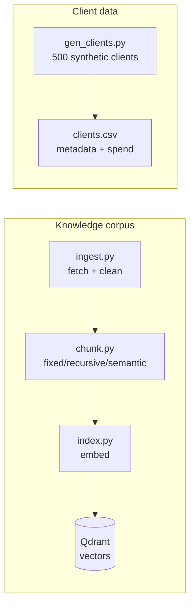
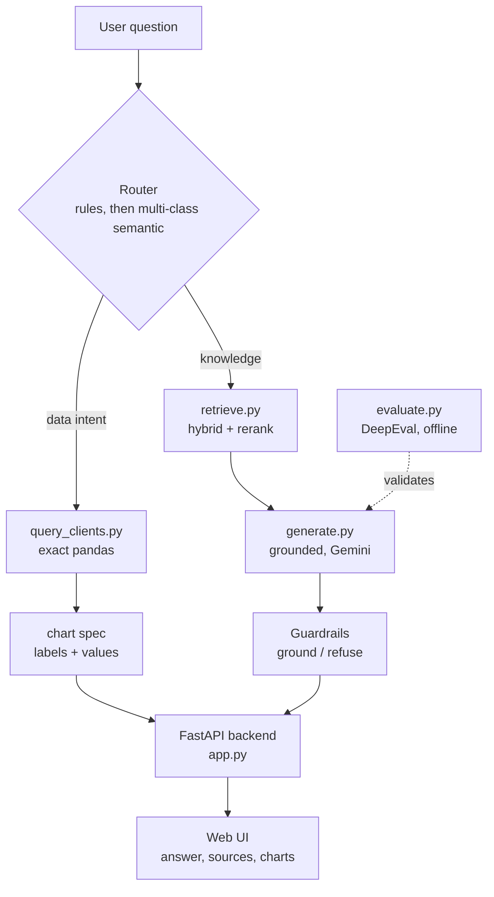

# Banking Assistant

A European retail-banking assistant that handles two different kinds of question in one chat interface. Ask it how a SEPA transfer works and it retrieves the answer from a banking corpus and cites its sources. Ask it how much a client spends on groceries, or for the age distribution of all clients, and it queries a client table directly and can draw you a chart.

The two question types are handled by two different backends, and a small router decides which one each question goes to. The router pairs fast keyword rules with a multi-class semantic fallback that classifies unusual phrasings by *intent*. The retrieval side is also set up as a benchmark of RAG methods rather than a single fixed pipeline, so the choice of chunking and retrieval strategy is measured rather than assumed.

Everything the repo *ships* is self-generated (the synthetic client table) or self-authored (the neobank FAQ). The public banking sources — Bundesbank and DPMA pages — are fetched at build time under their own reuse terms rather than redistributed, so the repo is safe to publish.

## Demo

Knowledge questions get grounded answers with sources, and out-of-scope questions are refused rather than answered from guesswork:


Data questions are answered with exact figures from the client table, and charts appear on request or from a button under any data answer:


The multi-class router catches data questions that keyword rules would miss — "how wealthy are our clients" and "break down customers by region" reach the right query by intent, while a genuinely out-of-scope question is still refused:



## How it works

The system has an offline build step and a runtime query flow.

### Build pipeline

Before any question is asked, two things are prepared: the knowledge corpus (fetched, chunked, embedded, stored in Qdrant) and the synthetic client table.



### Runtime flow

A question hits the router, which sends it down the data path or the RAG path. The RAG path ends in a guardrail stage that grounds the answer or refuses. DeepEval validates the RAG path offline.



The router works in two stages. First a fast rule-based check looks for client IDs, spending categories, aggregate words, counts, and distribution fields. If the rules don't recognise the question, a multi-class semantic fallback (`semantic_router.py`) takes over. Rather than making a binary data-vs-knowledge call, it embeds the question and matches it against example phrasings grouped by *intent* — `client_summary`, `client_spend_category`, `wealth`, `top_spenders`, `category_totals`, `average_by`, `count`, `distribution` — alongside a set of knowledge examples. The nearest intent wins, so an unusually-phrased data question like "how wealthy are our clients" or "break down customers by region" is not only kept on the data path but pointed straight at the right query function, even though it matches no keyword. A data intent only wins if it clears a similarity threshold *and* beats the closest knowledge example by a margin; otherwise the question falls through to RAG (when it's closer to a knowledge example) or is flagged as too uncertain to route on. Rules handle the obvious cases instantly and for free; the semantic fallback catches the rest. Extending it means adding an example sentence to an intent — no new rule, no new code.

The reason for splitting the two paths at all is that retrieval is the wrong tool for numbers. Embeddings are good at meaning but bad at arithmetic — they can't reliably sum, filter, or rank. So "how much does C0001 spend on groceries" goes to pandas, which computes an exact answer, while "how do SEPA transfers work" goes to retrieval, which is what it's actually good at. Note the division of labour: embeddings decide *which* query a question fits, but the answering is always exact pandas or retrieval — similarity never computes a figure.

## The two paths

### Knowledge questions (RAG)

Retrieval uses a hybrid of BM25 (exact-term matching) and dense embeddings, with an optional cross-encoder reranker on top. Hybrid matters here because banking questions are full of exact terms — IBAN, BIC, SEPA Core — that pure semantic search tends to blur. Generation answers only from the retrieved passages and refuses when the answer isn't there, which is the behaviour you want in a banking context. The refusal is a real feature, not a limitation: it's what stops the assistant inventing account rules.

### Data questions (structured data)

A set of pandas query functions in `query_clients.py` answer questions about a table of synthetic clients — 500 fake customers with metadata (age, city, tier, job, balance) and monthly spending across eight categories. Each intent from the semantic router maps to one of these functions. Supported questions include:

- Per-client lookup — "tell me about client C0001", "how much does C0001 spend on Lebensmittel" (German category names work too)
- Aggregates — "total spending by category", "top 5 grocery spenders in Leipzig", "average groceries by tier"
- Counts — "how many clients do we have", "how many premium clients"
- Distributions — "age distribution of clients", "clients by city", "gender breakdown"

How a client question resolves is a fixed rule, so the behaviour is predictable: a client ID on its own ("C0001", "spending of client C0001") returns that client's summary — balance, total spend, and top category. Add a category ("C0001 groceries") and you get just that figure. Ask for a chart ("diagram of C0001 spending") and you get the full category breakdown as a doughnut. Same client, three levels of detail, chosen by what you include in the question.

Each answer also carries a chart spec, so any data question can be visualised. Charts show automatically when the question asks for one ("show me a chart of…", "diagram of…"), and otherwise appear from a button under the answer. The router has honest limits — a phrasing that's too far from every example, or too close to the knowledge examples, deliberately isn't forced onto the data path — so the supported question types above are the documented boundary rather than a promise to understand everything.

## The RAG benchmark

The retrieval side is built to compare methods, not to ship one. Two axes are varied while the embedding model and vector store are held fixed:

| Axis | Variants |
|------|----------|
| Chunking | fixed-size, recursive, semantic |
| Retrieval | dense-only, hybrid (BM25 + dense), hybrid + reranker |

Evaluation uses [DeepEval](https://github.com/confident-ai/deepeval) with a golden Q&A set, scoring faithfulness, answer relevancy, and contextual precision/recall. `src/evaluate.py` runs a method and writes its scores to `results/`.


## Data sources

| Layer | Source | Terms | In the repo? | Role |
|-------|--------|-------|--------------|------|
| Payments / regulatory | Deutsche Bundesbank SEPA pages | © Bundesbank — reuse with source citation, unaltered, free of charge | No — fetched by `ingest.py` at build time | Term-dense corpus (IBAN, BIC, SEPA) |
| Government FAQ (PDF) | DPMA SEPA leaflet | German public-authority document — reuse under its own terms | No — fetched at build time | Exercises the PDF ingestion path |
| Neobank FAQ | Self-authored (`data/raw/neobank_faq.jsonl`) | This repo's licence | Yes — original content | Conversational support layer |
| Client table | Synthetic (`src/gen_clients.py`) | This repo's licence | Yes — generated, no real data | 500 fake clients for the data assistant |

The Bundesbank and DPMA material is pulled in by `ingest.py` when you build the corpus; the fetched and processed text (`data/processed/`) is `.gitignore`d rather than committed, so the repo redistributes only self-authored and synthetic data. Answers that draw on the fetched sources cite them. See [LICENSE](LICENSE) for the terms covering this repo's own code and data.

## Running it

```bash
pip install -r requirements.txt

# build the banking corpus
python src/ingest.py
python src/chunk.py --strategy recursive --in data/processed/corpus.jsonl --out data/processed/chunks_recursive.jsonl
python src/index.py --chunks data/processed/chunks_recursive.jsonl --collection banking_recursive

# generate the synthetic client data
python src/gen_clients.py --n 500

# set your Gemini key (used only for the knowledge path)
# PowerShell:  $env:GEMINI_API_KEY = "your-key"
export GEMINI_API_KEY="your-key"

# run the app
uvicorn src.app:app --reload --port 8000
# open http://localhost:8000
```

Data questions run entirely on pandas and need no API key. Only knowledge questions call Gemini.

The semantic router loads a small sentence-transformer (`all-MiniLM-L6-v2`) on first use to embed the intent examples; it runs locally and needs no API key. You can sanity-check its decisions directly:

```bash
python src/semantic_router.py "how wealthy are our clients" "break down customers by region" "tell me a joke"
```

Chart.js is served locally from `frontend/` rather than a CDN, so the UI works on networks that block external scripts.

### Running the benchmark

```bash
python src/evaluate.py --chunks data/processed/chunks_recursive.jsonl --collection banking_recursive --method dense --limit 10
python src/evaluate.py ... --method hybrid --limit 10
python src/evaluate.py ... --method hybrid_rerank --limit 10
```

## Stack

Python, FastAPI, Qdrant, sentence-transformers (embeddings, cross-encoder rerank, and intent routing), rank-bm25, pandas, Chart.js, Google Gemini, DeepEval.

## Layout

```
src/
  ingest.py         fetch and clean public sources into corpus.jsonl
  chunk.py          fixed / recursive / semantic chunkers
  index.py          embed and build the Qdrant index
  retrieve.py       dense / hybrid / hybrid+rerank retrieval
  generate.py       grounded generation with guardrails
  gen_clients.py    synthetic client data generator
  query_clients.py  pandas queries and chart specs
  router.py         data-vs-knowledge routing (rules + semantic fallback)
  semantic_router.py  multi-class intent routing (embedding similarity)
  app.py            FastAPI backend
  evaluate.py       DeepEval benchmark harness
frontend/
  index.html        chat UI with Chart.js
data/eval/          golden Q&A set
```

## Notes

This is a demonstration built on synthetic data and public banking sources used under their own reuse terms (with attribution, and fetched rather than redistributed). It isn't a production banking system and gives no financial advice. Gemini's free tier is tight on rate limit.
